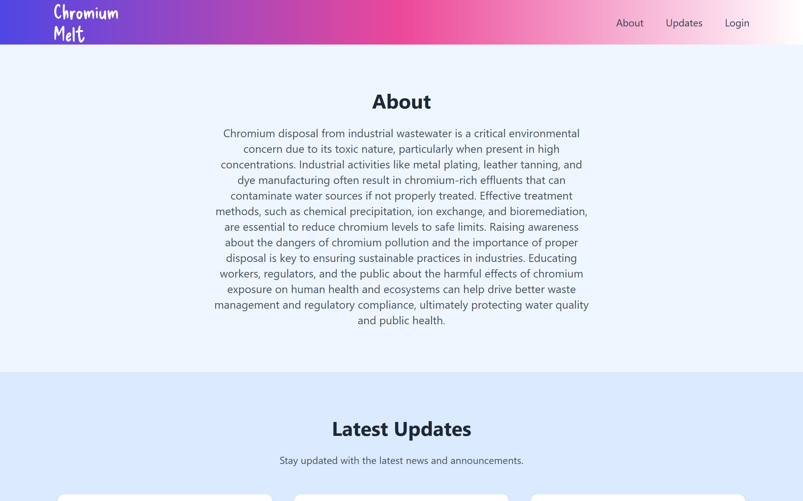
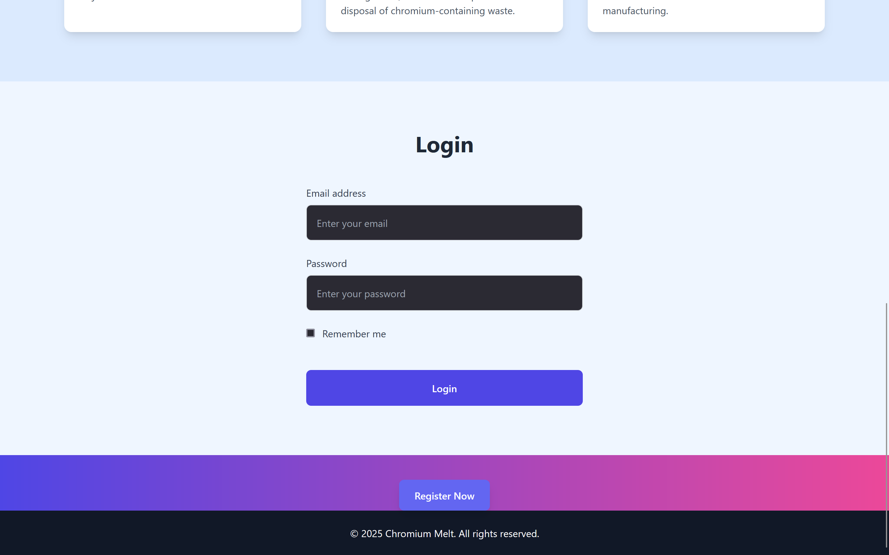
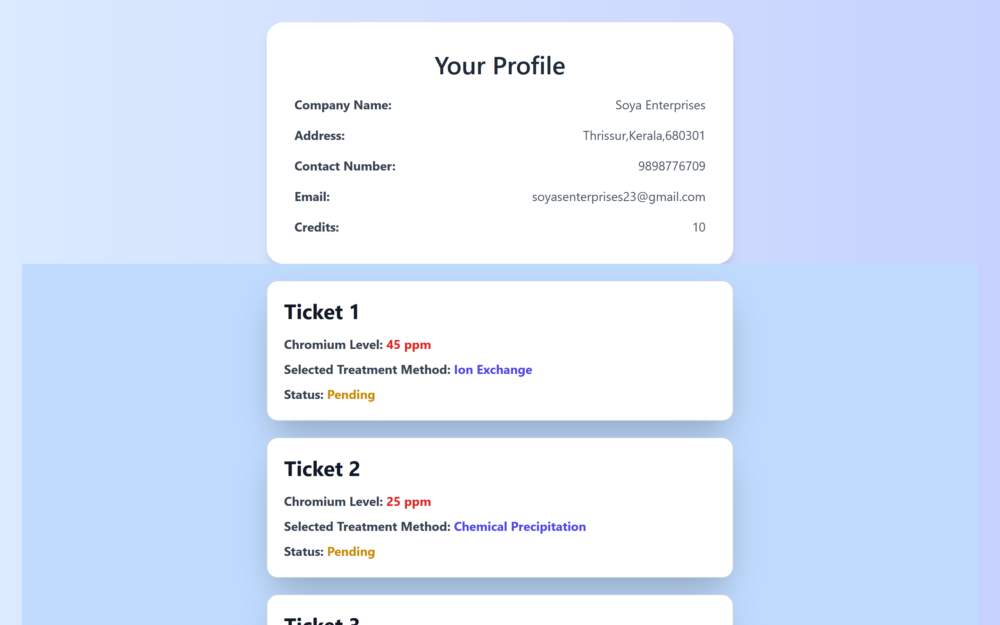
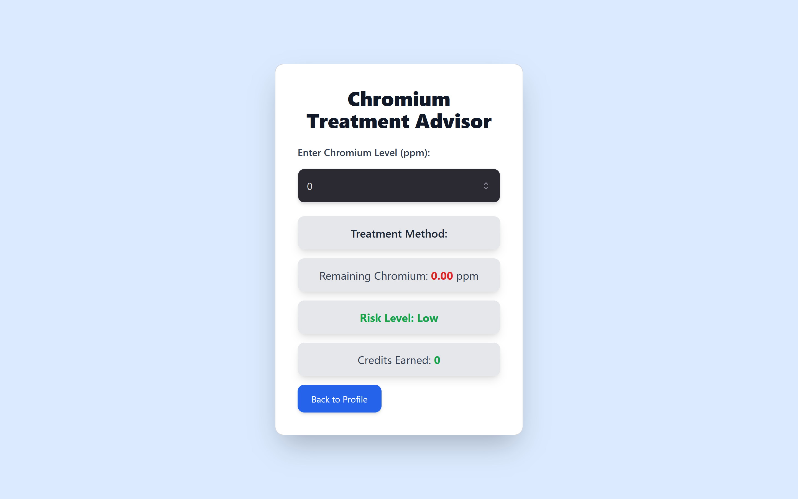
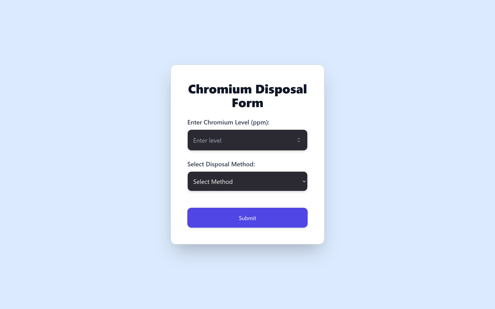

# Chromium Disposal Management System
Team Name: User Not Found

Team Members: 

Rosna P R-Sahrdaya College of Engineering and Technology
Sherin Saji-Sahrdaya College of Engineering and Technology
Soya C Babu-Sahrdaya College of Engineering and Technology

Project link: https://chromium-melt.vercel.app/

## Project Overview
This project is a **Chromium Disposal Management System** designed to help companies monitor and manage their chromium contamination levels. Companies can log in, input their chromium generation levels, select an appropriate disposal method, and track pending disposal tickets. The system calculates the remaining chromium content, assigns credits, and generates tickets accordingly.

## Features
- **Home Page**
  - Provides an overview of the system.
  - Companies can log in to access their chromium data.

- **Company Dashboard**
  - View current chromium contamination levels.
  - Check pending disposal tickets.
  
- **Chromium Input Form**
  - Input chromium generation levels (ppm).
  - Select a preferred chromium disposal method:
    - **Chemical Precipitation**
    - **Ion Exchange**
    - **Reverse Osmosis**
  
- **Results & Ticket Generation**
  - Calculate remaining chromium content after disposal.
  - Generate credits based on contamination reduction.
  - Create and track disposal tickets.

## Technology Stack
- **Frontend:** React, Tailwind CSS
- **State Management:** useState, useEffect
- **Backend (if applicable):** Node.js, Express.js
- **Database (if applicable):** MongoDB / Firebase

## Installation & Setup
1. Clone the repository:
   ```sh
   git clone <repository-url>
   cd chromium-disposal-system
   ```
2. Install dependencies:
   ```sh
   npm install
   ```
3. Start the development server:
   ```sh
   npm start
   ```

## Usage
- **Step 1:** Log in as a company.
- **Step 2:** Enter chromium contamination data.
- **Step 3:** Choose a disposal method.
- **Step 4:** View the remaining chromium content.
- **Step 5:** Receive credits and track pending tickets.

## Future Enhancements
- User authentication system for secure company logins.
- Graphical representation of chromium reduction trends.
- Integration with regulatory compliance bodies.








## License
This project is licensed under the MIT License.

